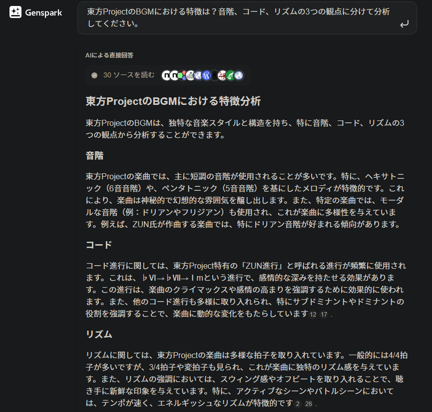
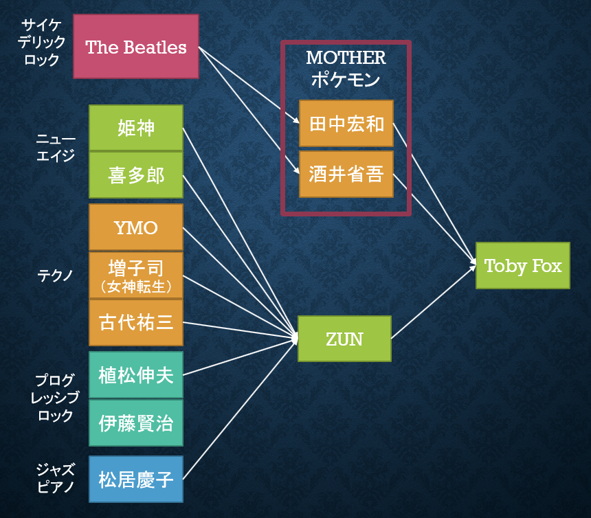

[アスタルテ アドベントカレンダ− 2024](https://adventar.org/calendars/9938) DAY20

20日のうちには書くと キッパリ言ったばかりなのに…… 
スマン ありゃ ウソだった

でも まあ クリスマスには間に合ったんだから
良しとするって事でさ……

こらえてくれ
  

# ジェネリック東方　～東方っぽい非東方曲集～

古山キリヲ(khirio@kirishima.cloud)

  

お久しぶりです。そうでない方は、はじめまして。古山キリヲです。

アドカレは二年ぶりですね。

最近、仕事とウマ活で忙しくてほとんど東方や作曲に手を付けられていませんが、今回のテーマは東方楽曲とさせていただきました。

東方ProjectのBGMや秘封倶楽部の原盤（東方原曲）を聞き飽きて、新しいものに飢えてる人向けに、東方っぽい楽曲たちを紹介していきます。

相変わらず微妙に詰めが甘いところもありますが、どうかご容赦ください。

## 1. そもそも「東方っぽい」とは？

以下に挙げる要素のうちいずれかが入ってれば、だいたいの曲は、東方っぽく聞こえます。

本文中に埋め込まれたリンクをクリックするとYouTubeとかに飛びます。聞いてみてね。

- IV-V-VIm進行（ジゴロ進行、東方進行）
  - 短調の王道進行IV-V-III-VImのIIIを省いたもの
  - 力強く解決力の高い進行
  - 「女神転生」のBGMでよく用いられる[（後述）](#2-zun曲のルーツ)
  - [「Over Soul」](https://www.youtube.com/watch?v=-VYMrLirXFY)など、たかはしごう作曲のアニソンによく使われる

- VIm-V-VI-III進行（四段流し）
  - ジャズによく用いられる
  - `アメリカ`のイメージ？
  - 意外なところでは[「デビルマンのうた」](https://www.youtube.com/watch?v=ip_547kDQM8)のイントロもこのコード進行
- VIm-III-V-II-VI-I-IIm-III（雪崩クリシェ、5度進行）
  - 東方では、紺珠伝以降の作品でよく用いられる
    - 前半部分のみを取り出してIV-V-VImにつなげることが多い
  - 鍵盤やギターで弾くと指運が気持ちいい
    - 下降クリシェと同時に、他の音もつられて雪崩のように下っていく
    - 下降クリシェのみの場合はVIm-Iaug-I-IIと進む
  - 松居慶子の[「Deep Blue」](https://www.youtube.com/watch?v=pZQ3iEcTRrs)をはじめ、用例には事欠かない
    - 一番有名な曲は[「Hotel Carifornia」](https://www.youtube.com/watch?v=Br3KkvgMAZY)
    - 一番古い曲はおそらくバッハの[「G線上のアリア」](https://www.youtube.com/watch?v=thQWqRDZj7E)
- Tresillo（トゥレシーヨ）
  - ♪. ♪. ♪（符点八分-符点八分-八分）のリズム
  - `ラテンアメリカ`発祥で、ジャズによく用いられる
  - 元をたどると、`アフリカンビート`に帰結
    - 四拍子の隙間（オフビート）に3連符を入れる[「二拍三連」](https://www.youtube.com/watch?v=uoOH9QCsdQQ)といったポリリズムの総称
    - この「二拍三連」を、八分音符の長さに合うようにスウィングさせたものがTresillo
  - 普通のメロディをこのリズムに展開するだけでも、十分東方っぽくなる
    - 後述の[Pia-no-jaC版「第9」](#4-1-pia-no-jac)を参照
- ニロ抜き音階（ペンタトニックスケールの一種）
  - 一般的には、ジャズによく用いられる
  - 音名ハニホヘトイロハ（ドレミファソラシド）の「ニ」と「ロ」の音、つまり「レ」と「シ」を抜いた音階
    - 短調の場合は、ラシドレミファソラの「シ」と「ファ」
    - 偶然にも「ニ」が2番目、「ロ」が7番目の音を表しているため覚えやすい（？）
  - 短調のニロ抜きは、日本の様々な民謡で使われる「民謡音階」
    - いわゆる`和風`音階
  - 長調のニロ抜きは、`中華`音階
- 短調ロ抜き（短調6度抜き）音階
  - ニロ抜き音階の制約を緩めたもの
  - ほとんどの東方原曲に登場
  - アニメ「からくりサーカス」2期OP[「ハグルマ」](https://www.youtube.com/watch?v=OT9fgIdo6Ow)など、アニソンでもわりとよく使われている

ここまでは結構いろんな曲にもある要素です。
逆にここから下に挙げる要素が揃ってたら「東方っぽさ」を狙って作ってるとしか思えない。

- 7sus4コードのアルペジオ
  - 東方では主にタイトル画面のテーマで登場
  - ストラヴィンスキー[「ペトルーシュカ」](https://www.youtube.com/watch?v=esD90diWZds)のイントロもこれ
  - `東欧～北欧`のイメージ？
- 短調1-5-4-5-3-5-2-5アルペジオ
  - 東方では主に「アリスミュージック」系の楽曲で登場
  - Flashの「もすかう」で有名な、DschinghisKhan[「MOSKAU」](https://www.youtube.com/watch?v=lyuFLU2Zqz0)のイントロなど
  - `東欧～西アジア系`のイメージ
  - ジョジョ3部後期OP（のサビ）くらいでしか聞いたことないぞ…？
- 短三度転調
  - key±3の転調
  - たしかFinal Fantasy VIIIのBGMでよく使われてたはず
  
これらの要素から分かる通り、実は東方原曲って`「和風」一辺倒ではない`んですね。
アメリカ・アフリカ・東欧・北欧・西アジアから中華まで、世界中の`様々なジャンル`の要素が混ざっていて、めちゃくちゃ`多国籍`で和洋折衷。もはや「東方」という新たなジャンルと言っても過言ではないくらい。

ちなみに今のところ、[ChatGPT](https://chatgpt.com/)や[Claude](https://claude.ai/)に「東方ProjectのBGMにおける特徴は？」と訊いてもこんな答えは返ってきません。他愛もない。AGIの実現はまだまだ先のようです。

（追記）[Genspark](https://www.genspark.ai/)は良い線いってるけど、やっぱりTresilloが出てこない

## 2. ZUN曲のルーツ

視点を変えて、東方Projectの原作者、ZUNさんの作曲スタイルについて、ルーツを探ってみましょう。
知ってる限りちょっと図にまとめてみました。（TobyFoxもいるけど）

ジャンルでいうと、やはりこのあたりに源流があります。
- ジャズピアノ、ジャズフュージョン（松居慶子）
  - [公式サイト](https://www16.big.or.jp/~zun/html/profile.html)や曲コメントにて「好きな音楽家」として言及があります。
- ニューエイジ（姫神、喜多郎）
  - とくに姫神については、東方旧作のころ曲コメントで何度も言及している程、お気に入りの様子。
- テクノ（YMO、増子司、古代祐三）
  - 人生で初めて耳コピした曲が[女神転生IIの「Explorer」](https://www.youtube.com/watch?v=eYewll8nVqk)であると各所で語っています。
    - IV-V-VIm進行は言わずもがな、夢時空・風神録・地霊殿の6面ボス曲に使われるフレーズの元ネタです。
  - 「東方」としての処女作である[「東方怪奇談」](https://www.youtube.com/watch?v=c-2v7Q7qCd0&pp=ygUP5p2x5pa55oCq5aWH6KuH)には、YMO[「RYDEEN」](https://www.youtube.com/watch?v=nB5g2cUM2FQ)のフレーズが思いっきり引用されています。
  - 古代祐三さんについては、[ご本人どうしも交流がある](https://x.com/yuzokoshiro/status/991958330808520704)そうです。
- プログレッシブロック（植松伸夫、伊藤賢治）
  - 想い出深いゲームとして、ZUNさんご本人が Final Fantasy IV とサガ2を各所で挙げています。
  - 小数点系の作品（「秘封ナイトメアダイアリー」等）において影響が顕著です。

この他にも永夜抄の「竹取飛翔」にて[「ゼビウス」](https://www.youtube.com/watch?v=mbSHIFUUDLg)のオマージュが入るなど、音楽性の根っこはかなり広範囲に張っています。

## 3. ジェネリック東方（アーティスト編）

では、いよいよ本題の、東方っぽい曲を多く発表しているアーティスト、いわばジェネリック東方四天王を紹介していきます。
上記で述べた、ZUN曲のルーツにあたる人たちは除いています。
だいたいみんなピアノジャズ系です。
1. fox caputure plan
2. jizue
3. SANOVA
4. 松谷卓

ここからはAmazonMusicのリンクを貼っていきますので、契約してない人はAppleMusicやSpotifyで同じアルバムを自分で探してください（　）

### 3-1. fox capture plan

東方っぽい、といえば、まずこの人たちは外せません（最近の曲はそうでもないけど）。ピアノ、ベース、ヴァイオリン、ドラムの4ピースを基本としつつ、ジャズ感強めで、テンポの速い曲が特徴のインストバンドです。
[デビュー当時](https://music.amazon.co.jp/albums/B00UR86N3S?trackAsin=B00UR86OHS&ref=dm_sh_d3fc-01ee-ca69-941d-b70e6)からVI-V-VIm進行を使いこなしています。

劇伴作曲家としても有名で、有名どころだと[「コンフィデンスマンJP」](https://music.amazon.co.jp/albums/B07D2GD42H?trackAsin=B07D2G6XXW&ref=dm_sh_779e-7667-376c-ca4b-b26c4)や[実写版「推しの子」](https://music.amazon.co.jp/albums/B0DMWBX476?ref=dm_sh_2e24-fb08-45b2-51cb-31641)の劇伴を担当してたりします。
TVから東方めいたフレーズが流れてくるの新鮮。

### 3-2. jizue

fox capture planとかなり似た作風ですが、ヴァイオリンがあまり出てこなかったり、ギターの出番が多かったり、三拍子の曲が多いことが特徴です。

NHK「クローズアップ現代」のEDテーマ[「sakura」](https://music.amazon.co.jp/albums/B01F1OEMJO?trackAsin=B01F1OEQJK&ref=dm_sh_acdb-19b7-50e8-b48d-4478b)や、ドラマ[「宙わたる教室」](https://music.amazon.co.jp/albums/B0DKP69CSX?ref=dm_sh_8a90-e015-92a2-9416-02ebc)などにも楽曲提供しています（NHKの回し者ではない）。

### 3-3. SANOVA

とにかくやばいです。
VI-V-VIm進行・Tresillo・短調6度抜きをハイレベルに組み合わせた作風が特徴です。
ダメ押しに短三度転調も登場します。
「東方新作の道中曲です」って聞かされたらマジで騙されるくらい。
ピアノ以外にもオルガンやシンセも器用に使いこなしています。
特にオススメは、この[「東海道メトロポリス」](https://music.amazon.co.jp/albums/B07WFHVBFZ?trackAsin=B07WDD5DSV&ref=dm_sh_914e-b1a4-854e-774a-65f31)です。

### 3-4. 松谷卓

ピアノを中心に置きつつ、どちらかというとテクノ寄りな感じです。
[「大改造！！劇的ビフォーアフター」](https://music.amazon.co.jp/albums/B0BPJMJWF1?ref=dm_sh_478c-0e6a-b72f-5c91-887b5)の曲でおなじみの方ですが、注目してほしい曲はこちらの[「S」](https://music.amazon.co.jp/albums/B00FUYQYWY?trackAsin=B00FUYQZ8M&ref=dm_sh_ed15-7847-7bfe-ee9a-76296)。
四段流し進行や短三度転調など、随所に東方要素を見つけることができます。
VirtualGuitaristのUltra（星蓮船でよく使われるギター音源）らしき音も出てくるし。

## 4. ジェネリック東方（楽曲編）

色々と聴いてきた中で、普段から東方っぽい曲は出していないアーティストについても、東方っぽい曲があり**ましたので**（ルメール弁）いくつか紹介していきます。

### 4-1. Pia-no-jaC
ピアノとカホン（Cajon、手で叩いて音を出す箱型の打楽器）の2ピースバンドです。
やたらパワフルなピアノさばきが特徴。ピアノは打楽器、（発音原理上は）何も間違ってない。
読み方が「ピアノジャク」で「天邪鬼」とかけている所も東方ポイント高め。

そして、紹介したいのはこちら[「交響曲 第9番 ニ短調 作品125「合唱」第四楽章」](https://music.amazon.co.jp/albums/B082ZCXTXD?trackAsin=B082ZD7F65&ref=dm_sh_967a-f000-38e4-3a70-872d1)
みんな大好きベートーヴェンの「第9」です。大晦日じゃなくてもいいんで聴いてください。
おなじみのフレーズがTresilloのリズムにアレンジされることで、一気に東方っぽく聞こえてきます。
四段流しもバリバリ決まってるし、これ実質東方風アレンジでは？

東方っぽさは劣るけど[「小フーガ ト短調」](https://music.amazon.co.jp/albums/B082ZCXTXD?trackAsin=B082ZDWSP5&ref=dm_sh_0bc1-4ba2-e7df-6210-368f6)（所謂「ハゲの歌」）のアレンジもいいぞ。

### 4-2. SEKAI NO OWARI
ついついゲス不倫（ゲスの極み乙女。）と混同されがちなバンド。
注目はこちらの[「Habit」](https://music.amazon.co.jp/albums/B09XK11CHM?trackAsin=B09XJYQN35&ref=dm_sh_6e99-ee9d-958e-1972-ec604)です。
最初から最後までほとんどB♭m-G#-F#-Fの四段流し進行で構成される、珍しい曲。

2022年の紅白歌合戦で流れたときは、一瞬「あれ、なんで東方アレンジサークルがNHKホールに？」と思ったり思わなかったり。

### 4-3. Hello Sleepwalkers
沖縄出身のロックバンドです（ぜんぜん沖縄感ないけど）。
~~[ウマ娘とジョジョ7部を混ぜたような曲](https://music.amazon.co.jp/albums/B0DHXLTP3T?trackAsin=B0DHXKBFZQ&ref=dm_sh_4fda-34f1-08d9-f2c4-1b5e9)も作ってます。~~

すごいのはこちらの[「プロジェクト」](https://music.amazon.co.jp/albums/B0BJ6ZZRKY?trackAsin=B0BJ72MJSX&ref=dm_sh_09b9-ab9c-fc6b-6e2c-197a7)です。
歌ありの曲ですが、なんと短調6度抜き、VI-V-VIm進行、Tresillo、発狂ピアノ、ありとあらゆる東方要素が揃っています。

これを聞いて、東方Projectの「Project」には、名詞の「企画」だけではなく、他動詞としての「投影する」という意味も含まれている、そんな考察を思い出しました。
私たちが作品を通して見ているものは、現実でも夢でもなく、あくまでも投影された「写像」に過ぎない。ゆえに東方原作も、幻想郷を原点として翻案された「二次創作」である、と。

ここで紹介してきた曲たちも、幻想郷に対する「写像」のひとつなのかも知れませんね。

## 5. 音楽生成AIは「ジェネリック」たり得るか？
ところで最近、自動作曲（音楽生成）AIも広まってきたので、試しにSUNOに何曲か作らせてみました。

IV-V-VIm進行のフレーズ与えてプロンプトに「new age」って入れとけば何かそれっぽくなる模様。
というわけで、こちらの[「Sunrise of the Mystic Mountain v1」](https://suno.com/song/6098506d-b22d-44b8-99c4-f91999ef93b2)を、お一つどうぞ。

後半のパートで一息入れて、西方っぽいフレーズから急にBadAppleっぽくなるところとか、結構いい線行ってるかも。やるじゃんSUNO。

## まとめ

というわけで今回は、東方原曲の音楽的ジャンル的な特徴と、東方っぽい曲を色々と紹介してきました。

みなさんもストリーミングサービスで、ここで挙げた曲を聞き漁ってみてください。
おすすめ曲のプレイリスト（自動で作成されるやつ）に東方っぽい曲がメッチャ出てくるようになって、QOLが上がります。試してみてね。
